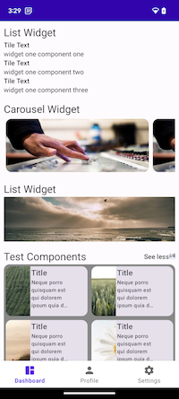
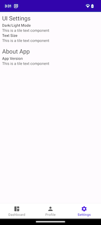

# Server Driven Compose POC

This project currently consists of one application. It is designed with view, material UI components, single activity multiple fragment, legacy navigation strategy etc. in mind to demonstrate a proof of concept that it is possible to migrate from a legacy code base to modern android development practices.

## Screenshots




## Widgets and Components concept

### Widget Contract

Widget basic structure
```json
{
  "type": "<string:non-nullable>",
  "components": "<array|slice:non-nullable>",
  "tag": "<object:nullable>"
}
```

#### List Widget

```json
{
  "type": "list",
  "components": [],
  "tag": "widget-1",
  "header": {
    "title": "Hello World Section"
  }
}
```

### Component Contract

Component basic structure
```json
{
  "type": "<string:non-nullable>",
  "data": "<object:non-nullable>",
  "action": "<object:nullable>"
}
```

#### Text Component
```json
{
  "type": "tile-text",
  "data": {
    "text": "hello, world"
  },
  "action": null
}
```

## TODO

 - [ ] add more example widgets/components
 - [ ] deeplink navigation for legacy app
 - [ ] second fragment host on top of main activity in legacy app
 - [ ] add new app designed with modern android development practices with server driven concept
